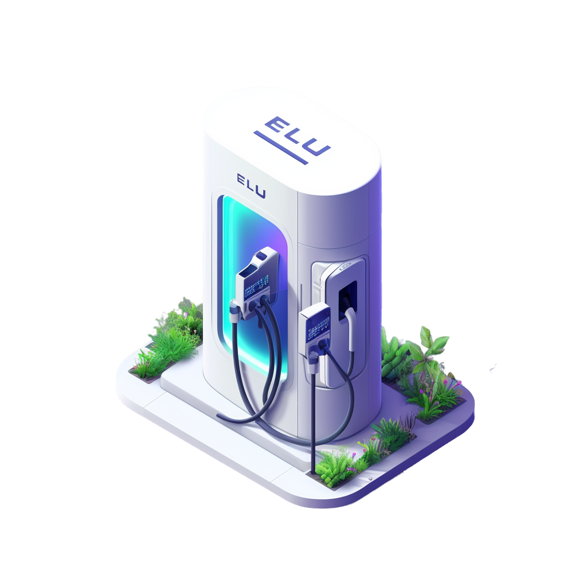

<p align="center">
  
</p>


# ELU Twins 
This is the open-source version of our product, ELU Twins. Its purpose is to simulate various components within the e-mobility ecosystem and their interactions, including EV charging. This enables easier testing and demonstration of e-mobility software, such as charge management systems.

## Disclaimer
We have decided to open-source our project to allow our customers to run it locally. Our main priority is on releasing new features, not on ensuring stability. This means that you may encounter issues and bugs. The project also includes a CSMS for OCPP 1.6 and OCPP 2.0.1 that are used for testing the digital twins. We provide no guarantee that the CSMS will work correctly.

# Description
ELU Twins emulates devices related to electromobility. With this project, it is possible to create virtual charge points (OCPP) and vehicles in seconds. Below is an overview of what has been implemented in the project so far.

# OCPP
These are the OCPP operations supported for now.

### OCPP 1.6

| **Initiatied by** |       **Operation**      | **Status** |             **Comments**             |
|:-----------------:|:---------------------------:|:----------:|:------------------------------------:|
| Charge point      | Boot notification        |      ✅       |                                      |
| Charge point      | Status notification      |      ✅       | Only some meter values are supported |
| Charge point      | Start transaction        |      ✅       |                                      |
| Charge point      | Stop transaction         |      ✅       |                                      |
| Charge point      | Status notification      |      ✅       |                                      |
| Charge point      | Heartbeat                |      ✅       |                                      |
| Charge point      | Authorize                |      ✅       | Under development                    |
| Charge point      | Heartbeat                |      ✅       |                                      |
| Central system    | Remote start transaction |      ✅       |                                      |
| Central system    | Remote stop transaction  |      ✅       |                                      |
| Central system    | Reserve now              |      🛠️       | Under development                    |
| Central system    | Set Charging Profile     |      🛠       | Under development                    |
| Central system    | Get Composite Schedule   |      🛠️       | Under development                    |
| Central system    | Get Configuration        |      🛠️       | Under development                    |
| Central system    | Change Configuration     |      🛠️       | Under development                    |


### OCPP 2.0.1

| **Initiatied by** | **Operation**                | **Status** |       **Comments**      |
|:-----------------:|------------------------------|:----------:|:-----------------------:|
| Charge point      | Boot notification request    |      ✅    |                         |
| Charge point      | Status notification request  |      ✅    |                         |
| Charge point      | Heartbeat request            |      ✅    |                         |
| Charge point      | Transaction event request    |      ✅    | start/stop/meter values |
| Central system    | Status notification response |      ✅    |                         |
| Central system    | Boot notification response   |      ✅    |                         |
| Central system    | Heartbeat response           |      ✅    |                         |
| Central system    | Transaction event response   |      ✅    |                         |

- Currently under development, the OCPP 2.0.1 version is not yet fully implemented, but we're working on it.

## Vehicle telemetry

|        **Operation**       | **Status** |             **Comments**             |
|:--------------------------:|:----------:|:------------------------------------:|
| Get power from current SoC |     ✅     | Used to build charging curves        |
| Update vehicle status      |     ✅     | Only some meter values are supported |
| Update current SoC         |     ✅     |                                      |

## How to use

### Set up docker configuration
Check and set .docker.env file

### Start docker services

Docker must be installed. We suggest building and running this project using Docker. This can be done as follows:

```shell
docker-compose up --build 
```

### What is running with docker-compose
After docker-compose is executed, the following services will be started:
1. **Public API**: this API expose user interactions, see interactive documentation [here](http://127.0.0.1:8000/docs)
2. **Private API**: this API exposes internal actions, see interactive documentation [here](http://127.0.0.1:8800/docs)
3. **celery**: charge point orchestrator for simulating multiple charge points, see [here](https://docs.celeryq.dev/en/stable/#)
4. **flower**: (http://localhost:5555/) - Frontend for celery, see [here](https://flower.readthedocs.io/en/latest/) for more information
5. **Csmsv2**: CSMS for OCPP 2.0.1 used for testing
6. **csmsv16**: CSMS for OCPP 1.6 used for testing
7. **Redis**: Enabling communcation between user and charge points
8. **DB**: Postgres database to store states

### Examples of how to use the API

#### Step 1 - How to create a user and token

First create a user. All charge points and vehicles will then belong to that user.

```python
import requests

# create user
headers = {
    "accept": "application/json",
    "Content-Type": "application/json",
}

json_data = {'username': user,'password': password }

create_user_url = 'http://localhost:8800/user/'
response = requests.post(create_user_url, headers=headers, json=json_data)
```

#### Step 2 Create user and app token

```python
data = {
    'grant_type': '',
    'username': user,
    'password': password,
    'scope': '',
    'client_id': '',
    'client_secret': '',
}
token_url = 'http://localhost:8000/token'

response = requests.post(token_url, headers=headers, data=data)
token = response.json().get("access_token")
```

You can use the user token to generate an app token where you can define when the app token expires. To create an app token, you can do the following:

```python
import requests

headers = {
    "accept": "application/json",
    "Authorization": "Bearer **insert token from step 1 here**",
    "Content-Type": "application/json",
}

data = {"name": "test", "expiry_in_days": 3}
    
response = requests.post(app_token_url, headers=headers, json=data)
if response.status_code == 200:
    print("token generated")
    token = response.json().get("access_token")
else:
    print(response.text)
```

**The token has to be added to the header for any calls to the API as shown in the examples below.**

#### Step 3 - How to create assets

##### Create a vehicle
```python
import requests 

headers = {
    "accept": "application/json",
    "Authorization": "Bearer **insert token from step 1 here**",
    "Content-Type": "application/json",
}
# create vehicle

json_data = {"name": "ELU vehicle one", "battery_capacity": 65, "maximum_charging_rate": 50}

vehicle_url = "http://localhost:8000/twin/vehicle/"

response = requests.post(vehicle, headers=headers, json=json_data)
```
If successful, the returned response is 

```javascript
{'created_at': '2024-05-06T06:30:56.568111',
 'updated_at': '2024-05-06T06:30:56.568177',
 'name': 'ELU vehicle one',
 'id_tag_suffix': 'NEAKPLTYIK',
 'battery_capacity': 65,
 'maximum_dc_charging_rate': 50,
 'maximum_ac_charging_rate': 50,
 'soc': 10.0,
 'status': 'ready-to-charge',
 'id': '1140b70f-9971-41b6-bd70-8a59e4242002',
 'transaction_id': None}
```

##### Create a charge point

```python
import requests 

headers = {
    "accept": "application/json",
    "Authorization": "Bearer **insert token from step 1 here**",
    "Content-Type": "application/json",
}

json_data = {
    "name": "ELU Charger 1",
    "maximum_dc_power": 180,
    "maximum_ac_power": 20,
    "ocpp_protocol": "ocpp1.6",
    "csms_url": "ws://csmsv16:9000", # Add your own csms url if needed
    "evses": [
        {"connectors": [{"connector_type": "cCCS1"}]},
        {"connectors": [{"connector_type": "cCCS1"}]},
    ],
}
charger = "localhost:8000/twin/charge-point/"

response = requests.post(charger, headers=headers, json=json_data)

```
If successful, the returned response is 
```javascript
{'name': 'ELU Charger 1',
 'cid': 'ELU-WIU4-KNKTT-821XH28NUWB',
 'vendor': 'Elu Twin',
 'model': 'Digital Twin',
 'password': '1234',
 'csms_url': 'ws://csms:9000',
 'ocpp_protocol': 'ocpp1.6',
 'boot_reason': None,
 'voltage_ac': 230,
 'voltage_dc': 400,
 'maximum_dc_power': 180,
 'maximum_ac_power': 20,
 'status': 'Unavailable',
 'charge_point_task_id': None,
 'last_heartbeat': None,
 'token_cost_per_minute': 2,
 'id': '425d8189-746c-4295-a57d-8ed1e89ccc75',
 'quota_id': '2e87f9e3-a789-4254-b29e-1a2b2d293ba5',
 'ocpp_configuration_v16_id': '07c13e4b-ceea-4167-8017-7c3fc5efb612',
 'created_at': '2024-05-06T06:31:00.583905',
 'updated_at': '2024-05-06T06:31:00.583943',
 'evses': [{'created_at': '2024-05-06T06:31:00.591886',
   'updated_at': '2024-05-06T06:31:00.591911',
   'id': 'bbf1820b-e2d9-4c85-9746-8169df2d0c12',
   'evseid': 1,
   'status': 'unavailable',
   'active_connector_id': None,
   'connectors': [{'created_at': '2024-05-06T06:31:00.596059',
     'updated_at': '2024-05-06T06:31:00.596073',
     'id': '7da880c2-604e-4980-ba06-0683daf0672d',
     'connectorid': 1,
     'status': 'unavailable',
     'current_dc_power': 0,
     'current_dc_current': 0,
     'current_dc_voltage': 0,
     'current_ac_power': 0,
     'current_ac_current': 0,
     'current_ac_voltage': 0,
     'current_energy': 0.0,
     'total_energy': 0.0,
     'soc': None,
     'connector_type': 'cCCS1',
     'id_tag': None,
     'transactionid': None,
     'queued_action': [],
     'transaction_id': None,
     'vehicle_id': None}]},
  {'created_at': '2024-05-06T06:31:00.598812',
   'updated_at': '2024-05-06T06:31:00.598820',
   'id': 'b1eaca84-d9ce-4f50-b4d0-972daa38834d',
   'evseid': 2,
   'status': 'unavailable',
   'active_connector_id': None,
   'connectors': [{'created_at': '2024-05-06T06:31:00.600922',
     'updated_at': '2024-05-06T06:31:00.600943',
     'id': '2ea0591c-5546-4486-9a75-62f62a0a9704',
     'connectorid': 2,
     'status': 'unavailable',
     'current_dc_power': 0,
     'current_dc_current': 0,
     'current_dc_voltage': 0,
     'current_ac_power': 0,
     'current_ac_current': 0,
     'current_ac_voltage': 0,
     'current_energy': 0.0,
     'total_energy': 0.0,
     'soc': None,
     'connector_type': 'cCCS1',
     'id_tag': None,
     'transactionid': None,
     'queued_action': [],
     'transaction_id': None,
     'vehicle_id': None}]}],
 'user_id': '52ca0620-a51a-4233-bd16-4250b163ca06'}
```

#### Step 4 - Connect a charge point to a CSMS

To connect a charger, you need the ID of the charger you want to connect. In Step 2, in the returned object of creating a charger, we get the ID. In the example above, the ID is ```425d8189-746c-4295-a57d-8ed1e89ccc75```. To connect a charger, we do the following:
```python

headers = {
    "accept": "application/json",
    "Authorization": "Bearer **insert token from step 1 here**",
    "Content-Type": "application/json",
}
json_data = { "charge_point_id": '425d8189-746c-4295-a57d-8ed1e89ccc75'}
            
response = requests.post(url="localhost:8000/twin/charge-point/action/connect-charger", headers=headers, json=json_data)
```

#### Step 5 - Start a charging session

Now the charger is available for charging and you can start charging sessions. To start a charging session, you need the ID of the connector and the ID of the vehicle you want to start charging.

```python
headers = {
    "accept": "application/json",
    "Authorization": "Bearer **insert token from step 1 here**",
    "Content-Type": "application/json",
}
json_data = {
    "connector_id": "7da880c2-604e-4980-ba06-0683daf0672d",
    "vehicle_id": "1140b70f-9971-41b6-bd70-8a59e4242002",
}
    
start_url = "localhost:8000/twin/charge-point/action/start-transaction"
response = requests.post(start_url, headers=headers, json=json_data)
```

If successful, a transaction object is returned 
```javascript
{
  "created_at": "2024-05-08T13:50:46.935050",
  "updated_at": "2024-05-08T13:50:55.957265",
  "id": "b57979ba-c071-4dbf-8fb6-233f174e8d6f",
  "start_time": "2024-05-08T13:50:46.935152",
  "end_time": null,
  "energy": 0,
  "status": "Charging",
  "transactionid": "5111967",
  "connector_id": "a16f31c3-50f9-45bb-87c8-31c65f4dc4cf",
  "vehicle_id": "ca22f8e2-8a91-487d-8701-d185a6dd7a7e",
  "user_id": "1a47b844-3223-4e66-b9a6-1663079aced0",
  "evse_id": "c19e2f02-6455-49ff-a071-fc68fa209707",
  "charge_point_id": "58a8a4d2-5683-4fd5-af3d-7cb7eb6ca4dc"
}
```

#### Step 6 - Stop a charging session

To stop a charging session, you need the ID of the transaction. In the example above, the ID is ```b57979ba-c071-4dbf-8fb6-233f174e8d6f ```

```python
headers = {
    "accept": "application/json",
    "Authorization": "Bearer **insert token from step 1 here**",
    "Content-Type": "application/json",
}

json_data = {"transaction_id": "b57979ba-c071-4dbf-8fb6-233f174e8d6f" }

stop_url = "localhost:8000/twin/charge-point/action/stop-transaction"
response = requests.post(stop_url, headers=headers, json=json_data)
```

#### Further examples
You can check out the jupyter notebook found under [here](notebooks/quick_start_api.ipynb).

## Next steps
- Improve test coverage
- Incorporate additional OCPP 1.6 and 2.0.1 operations
  
## How to contribute
We welcome contributions from everyone who is willing to improve this project. Whether you're fixing bugs, adding new features, improving documentation, or suggesting new ideas, your help is greatly appreciated! Just make sure you follow these simple guidelines before opening up a PR:

1. Follow the [Code of Conduct](CODE_OF_CONDUCT.md): Always adhere to the Code of Conduct and be respectful of others in the community.
2. Test Your Changes: Ensure your code is tested and as bug-free as possible.
3. Update Documentation: If you're adding new features or making changes that require it, update the documentation accordingly.
